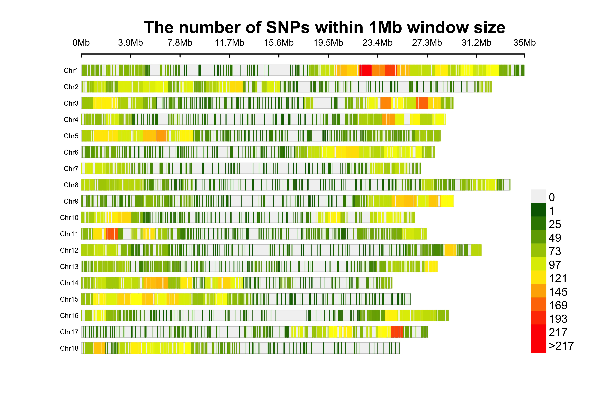

## Checking the Imputations

```{r Comparing the G matrix between the Genotyping Platforms, message = F, warning = F}
library(tidyverse); library(data.table);library(sommer); library(GGally)
DArTMkrs <- readRDS(file = here::here("output", "DArT2022", "DCas22_DArT_ReadyForGP_Dos.rds"))
GBSDArTMkrs <- readRDS(file = here::here("output", "DCas22_6902", "DCas22_GBSandDArT_ReadyForGP_Dos.rds"))
GBSMkrs <- readRDS(file = here::here("output", "DadosGBSAtualizados.rds"))

RefPop <- read.table(file = here::here("output", "DCas22_6902/", "DArTClonesVerifiedIDB.txt"),
                     header = F, sep = "\t") %>% filter(!V1 %like% "1447")
RefPop2 <- read.table(file = here::here("output", "DCas22_6902", "IDBPlinkCommonClones.csv"),
                      header = T, sep = ",") %>%
  mutate(IID1 = gsub(pattern = ":", replacement = ".", x = IID1) %>% 
           gsub(pattern = "2014_", replacement = "X2014_") %>% 
           gsub(pattern = "2011_", replacement = "X2011_") %>% 
           gsub(pattern = "9815006.250370267", replacement = "X9815006.250370267")%>% 
           gsub(pattern = "965502.250370266", replacement = "X965502.250370266"))
RefPop2 <- RefPop2[RefPop2$IID2 %in% RefPop$V1,]

DArTMkrsRef <- DArTMkrs[rownames(DArTMkrs) %in% RefPop$V1,]
GBSDArTMkrsRef <- GBSDArTMkrs[rownames(GBSDArTMkrs) %in% RefPop$V1,]
GBSMkrsRef <- GBSMkrs[rownames(GBSMkrs) %in% RefPop2$IID1,]
dim(DArTMkrsRef); dim(GBSDArTMkrsRef); dim(GBSMkrsRef)
rm(DArTMkrs); rm(GBSDArTMkrs)

MAFD <- tibble(Freq = colMeans(DArTMkrsRef)) %>% mutate(MAF = ifelse(Freq > 0.5,
                                                                     yes = 1 - Freq,
                                                                     no = Freq),
                                                        .keep = "unused")
MAFGD <- tibble(Freq = colMeans(GBSDArTMkrsRef)) %>% mutate(MAF = ifelse(Freq > 0.5,
                                                                     yes = 1 - Freq,
                                                                     no = Freq),
                                                            .keep = "unused")
MAFG <- tibble(Freq = colMeans(GBSMkrsRef)) %>% mutate(MAF = ifelse(Freq > 0.5,
                                                                    yes = 1 - Freq,
                                                                    no = Freq),
                                                       .keep = "unused")

DArTMkrsRef <- DArTMkrsRef[ , MAFD >= 0.05]
GBSDArTMkrsRef <- GBSDArTMkrsRef[ , MAFGD >= 0.05]
GBSMkrsRef <- GBSMkrsRef[ , MAFG >= 0.05]
dim(DArTMkrsRef); dim(GBSDArTMkrsRef); dim(GBSMkrsRef)


rownames(GBSMkrsRef) <- RefPop2$IID2
GBSMkrsRef <- GBSMkrsRef[order(match(rownames(GBSMkrsRef), rownames(DArTMkrsRef))),]

GMD <- A.mat(DArTMkrsRef - 1)
GMGD <- A.mat(GBSDArTMkrsRef - 1)
GMG <- A.mat(GBSMkrsRef - 1)
```

### GBS only Markers Density
```{r GBS Markers Density, eval = F}
library(CMplot)
CMsnps <- tibble(SNP = colnames(GBSMkrs),
                 chr = substring(SNP,1,5),
                 pos = substring(SNP,6)) %>%
  mutate(chr = gsub(pattern = ":", replacement = "", x = chr) %>%
           gsub(pattern = "chr", replacement = "") %>% as.integer,
         pos = gsub(pattern = ":", replacement = "", x = pos) %>% as.integer)
CMplot(CMsnps, plot.type = "d", bin.size = 1e6, col = c("darkgreen", "yellow", "red"),
       file = "jpg", memo = "GBSDensityMkrs", dpi = 500, file.output = T, verbose = TRUE)
```


### Fig 1. Density Markers for DArT genotyping


### Fig 2. Correlogram of diagonal index of the Genotyping platforms
```{r Correlogram Diag, echo = F}
DiagPlot <- tibble(DArT = diag(GMD),
                   GBSDArT = diag(GMGD),
                   GBS = diag(GMG))

ggpairs(DiagPlot)
```

### Fig 3. Correlogram of the out diagonal index of the Genotyping platforms
```{r Correlogram OutDiag, echo = F}
OutDiagPlot <- tibble(DArT = GMD[upper.tri(GMD,diag = F)],
                      GBSDArT = GMGD[upper.tri(GMGD, diag = F)],
                      GBS = GMG[upper.tri(GMG, diag = F)])

ggpairs(OutDiagPlot)
```

