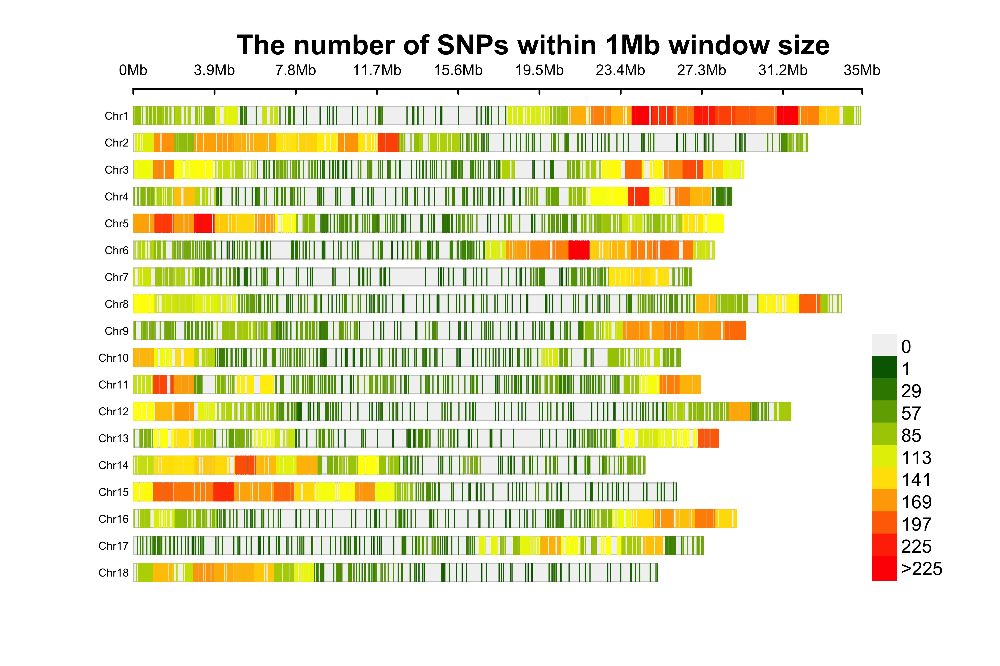

## Verify the Common SNP Markers ([Manihot esculenta v6.1](https://phytozome-next.jgi.doe.gov/info/Mesculenta_v6_1)) and Clones

```{r Joint the Chromosomes VCF files in one, eval = F}
library(here)
system(paste0("bcftools concat ",
              "--output ",
              "tassel_embrapa_newfastq.bial.recode.vcf.gz ",
              "--output-type z --threads 18 ",
              paste0("tassel_embrapa_newfastq.chr",1:18,
                     ".bial.recode.vcf.gz",
                     collapse = " ")))
```

GBS data has 3,456 genotyped clones for 400,122 SNP markers

| Chromosome | N˚Markers | Chromosome | N˚Markers | Chromosome | N˚Markers |
| :--------: | :-------: | :--------: | :-------: | :--------: | :-------: |
| Chr 1  | 36,510 | Chr 7  | 15,271 | Chr 13 | 18,743 |
| Chr 2  | 28,503 | Chr 8  | 21,154 | Chr 14 | 24,541 |
| Chr 3  | 25,488 | Chr 9  | 21,216 | Chr 15 | 23,530 |
| Chr 4  | 22,497 | Chr 10 | 19,127 | Chr 16 | 18,031 |
| Chr 5  | 24,234 | Chr 11 | 22,587 | Chr 17 | 18,385 |
| Chr 6  | 23,841 | Chr 12 | 18,705 | Chr 18 | 17,759 |
|        |       |        |       |        |       |


```{r Common Mkrs}
library(here); library(tidyverse)
GBSVCFFile <- read.table(file = here::here("data", "GBS", "tassel_embrapa_newfastq.bial.recode.vcf"),
                         comment.char = "", header = T, skip = 31)
GBSMkrs <- GBSVCFFile %>% select(ID, REF, ALT, X.CHROM, POS) %>%
  mutate(IDPol = paste0(ID,"_", REF, "/", ALT))
write.table(x = GBSMkrs, file = here::here("output", "DArT2022", "GBSMkrs.txt"),
            quote = F, row.names = F)
GBSMkrs <- read.table(file = here::here("output", "DArT2022", "GBSMkrs.txt"), header = T)
DArTMkrs <- read.table(file = here::here("output", "DArT2022", "DArTMkrs.txt"), header = T)

CommonMkrs <- list(DArT = DArTMkrs$IDPol,
                   GBS = GBSMkrs$IDPol)
CMkrs <- inner_join(DArTMkrs, GBSMkrs, by = c("IDPol"), suffix = c("DArT", "GBS"))
CMkrs2 <- CMkrs %>% dplyr::select(IDDArT, REFDArT, ALTDArT, X.CHROMDArT, POS) %>% 
  rename(ID = IDDArT,
         REF = REFDArT,
         ALT = ALTDArT,
         Chr = X.CHROMDArT,
         Pos = POS)
write.table(CMkrs2, file = here::here("data", "CommonMkrsGBSDArT.txt"), row.names = F,
            quote = F, sep = "\t")
write.table(CMkrs2 %>% dplyr::select(Chr, Pos), file = here::here("data", "CommonMkrsGBSDArT"),
            row.names = F, col.names = F, quote = F, sep = "\t")
CMkrsIssues <- inner_join(DArTMkrs, GBSMkrs, by = c("ID"),
                           suffix = c("DArT", "GBS")) %>% 
  filter(IDPolDArT != IDPolGBS)
write.table(CMkrsIssues %>% dplyr::select(X.CHROMGBS, POS),
            file = here::here("data", "CommonMkrsGBSDArTIssues"),
            row.names = F, col.names = F, quote = F, sep = "\t")
```

### Fig 1. Venn Diagram of the common SNP markers between the GBS and DArT genotyping platforms
```{r Fig1, echo = F}
library(ggvenn)
ggvenn(CommonMkrs)
```

| Chr | N˚SNP only DArT | N˚ DArT + GBS | N˚SNP GBS |
| :-: | :--------: | :-----------: | :-------: |
| 1   | 881 | 183 | 36,327 |
| 2   | 593 | 103 | 28,400 |
| 3   | 581 | 101 | 25,387 |
| 4   | 588 | 94  | 22,403 |
| 5   | 533 | 101 | 24,133 |
| 6   | 552 | 104 | 23,737 |
| 7   | 366 | 62  | 15,209 |
| 8   | 438 | 94  | 21,060 |
| 9   | 431 | 89  | 21,127 |
| 10  | 577 | 87  | 19,040 |
| 11  | 507 | 84  | 22,503 |
| 12  | 381 | 87  | 18,618 |
| 13  | 434 | 74  | 18,669 |
| 14  | 592 | 115 | 24,426 |
| 15  | 435 | 81  | 23,449 |
| 16  | 360 | 77  | 17,954 |
| 17  | 464 | 79  | 18,306 |
| 18  | 408 | 72  | 17,687 |
|     |     |     |        |
| Total | 10,628 | 1,560 | 400,122 |

```{bash Separing the Common Markers per Genotyping Platform, eval = F}
vcftools --gzvcf output/DArT2022/DCas22_6902_DArTseqLD_AllSites_AllChrom_raw.vcf.gz --positions data/CommonMkrsGBSDArT --recode --stdout | bgzip -c -@ 3 > output/DCas22_6902/DArTCommonMkrs.vcf.gz

vcftools --gzvcf data/GBS/tassel_embrapa_newfastq.bial.recode.vcf.gz --positions data/CommonMkrsGBSDArT --recode --stdout | bgzip -c -@ 3 > output/DCas22_6902/GBSCommonMkrs.vcf.gz
```

## Verify the Common Clones genotyped

```{r check for Duplicates in each genotyping platform}
GBSClones <- read.table(file = here::here("data", "GBS", "EM_matched_accessions-GBS.csv"),
                        sep = ",", header = T)

## Duplicates in GBS genotyping platform
dup <- GBSClones[GBSClones$uniquename_in_db %in%
                   GBSClones$uniquename_in_db[duplicated(GBSClones$uniquename_in_db)],] %>%
  .[order(.[,2]),]
dup1 <- GBSClones[duplicated(GBSClones$uniquename_in_db),] %>% .[order(.[,2]),]
dup2 <- dup[!dup$x %in% dup1$x,] %>%
  .[order(.[,2]),] %>% mutate(FILE = "2")
dup3 <- dup1[duplicated(dup1$uniquename_in_db),] %>%
  .[order(.[,2]),] %>% mutate(FILE = "3")
dup1 <- dup1[!dup1$x %in% dup3$x,] %>% mutate(FILE = "1")


write.table(x = rbind(dup1, dup2, dup3), quote = F, row.names = F, sep = "\t",
            file = here::here("data", "GBS", "AllGBSDuplicates.txt"))

write.table(x = dup1$x, file = here::here("data", "GBS", "GBSDuplicates1.txt"),
            sep = "\t", row.names = F, col.names = F, quote = F)
write.table(x = dup2$x, file = here::here("data", "GBS", "GBSDuplicates2.txt"),
            sep = "\t", row.names = F, col.names = F, quote = F)
write.table(x = dup3$x, file = here::here("data", "GBS", "GBSDuplicates3.txt"),
            sep = "\t", row.names = F, col.names = F, quote = F)
### Marnin had an excellent idea of sums the counts for each allele for the duplicates individuals

## Duplicates in DArT genotyping platform
DArTClones <- read.table(file = here::here("data", "DArTGPInfo2.csv"),
                         sep = ",", header = T)

Dup <- DArTClones[DArTClones$Observation_unit_name %in% 
                    DArTClones$Observation_unit_name[duplicated(DArTClones$Observation_unit_name)],]
Dup1 <- DArTClones %>% filter(duplicated(DArTClones$Observation_unit_name)) %>% 
  filter(!duplicated(.[,"Observation_unit_name"])) %>% 
  .[order(.[,"Observation_unit_name"]),] %>% mutate(FILE = "1")
Dup2 <- Dup %>% filter(!Dup$exported_tissue_sample_name %in%
                         Dup1$exported_tissue_sample_name) %>%
  filter(!duplicated(.[,"Observation_unit_name"])) %>% mutate(FILE = "2")
Dup3 <- Dup %>% filter(!Dup$exported_tissue_sample_name %in%
                             (rbind(Dup1, Dup2) %>%
                                .[,"exported_tissue_sample_name"])) %>% 
  filter(!duplicated(.[,"Observation_unit_name"])) %>% mutate(FILE = "3")
Dup4 <- Dup %>% filter(!Dup$exported_tissue_sample_name %in%
                             (rbind(Dup1, Dup2, Dup3) %>%
                                .[,"exported_tissue_sample_name"])) %>%
  mutate(FILE = "4")

write.table(x = rbind(Dup1, Dup2, Dup3, Dup4), quote = F, row.names = F, sep = "\t",
            file = here::here("data", "AllDArTDuplicates.txt"))

write.table(x = Dup1$DarTMatch, file = here::here("data", "DArTDuplicates1.txt"),
            sep = "\t", row.names = F, col.names = F, quote = F)
write.table(x = Dup2$DarTMatch, file = here::here("data", "DArTDuplicates2.txt"),
            sep = "\t", row.names = F, col.names = F, quote = F)
write.table(x = Dup3$DarTMatch, file = here::here("data", "DArTDuplicates3.txt"),
            sep = "\t", row.names = F, col.names = F, quote = F)
write.table(x = Dup4$DarTMatch, file = here::here("data", "DArTDuplicates4.txt"),
            sep = "\t", row.names = F, col.names = F, quote = F)
```

Check the duplicates in each genotyping platform [link](Duplicates.html)

### Fig 2. Venn Diagram of the common clones between the GBS and DArT genotyping platforms
```{r Fig2, echo = FALSE}
library(ggvenn)
ggvenn(list(GBS = unique(GBSClones$uniquename_in_db),
            DArT = unique(DArTClones$Observation_unit_name)))
UnDArTClones <- unique(DArTClones$Observation_unit_name)
UnGBSClones <- unique(GBSClones$uniquename_in_db)
```

```{r Duplicates of the Common Clones, eval = F}
CommonClones <- GBSClones$uniquename_in_db[GBSClones$uniquename_in_db %in%
                                             DArTClones$Observation_unit_name] %>%
  unique

GBSComClones <- GBSClones[GBSClones$uniquename_in_db %in% CommonClones,] %>%
  arrange(uniquename_in_db)
DArTComClones <- DArTClones[DArTClones$Observation_unit_name %in% CommonClones,] %>%
  arrange(Observation_unit_name)

GBSComClones1 <- GBSComClones %>% filter(!duplicated(GBSComClones$uniquename_in_db)) %>% 
  .[order(.[,"uniquename_in_db"]),] %>% mutate(FILE = "G1")
GBSComClones2 <- GBSComClones %>% filter(!GBSComClones$x %in% GBSComClones1$x) %>% 
  filter(!duplicated(.[,"uniquename_in_db"])) %>% .[order(.[,"uniquename_in_db"]),] %>% 
  mutate(FILE = "G2")
GBSComClones3 <- GBSComClones %>% filter(!GBSComClones$x %in%
                                           (rbind(GBSComClones1, GBSComClones2) %>%
                                              .[,"x"])) %>% 
  filter(!duplicated(.[,"uniquename_in_db"])) %>% .[order(.[,"uniquename_in_db"]),] %>% 
  mutate(FILE = "G3")

write.table(rbind(GBSComClones1, GBSComClones2, GBSComClones3),
            file = here::here("output", "DCas22_6902", "AllGBSComClones.txt"),
            quote = F, sep = "\t")

write.table(GBSComClones1$x, file = here::here("output", "DCas22_6902", "GBSComClones1"),
            row.names = F, col.names = F, quote = F, sep = "\t")
write.table(GBSComClones2$x, file = here::here("output", "DCas22_6902", "GBSComClones2"),
            row.names = F, col.names = F, quote = F, sep = "\t")
write.table(GBSComClones3$x, file = here::here("output", "DCas22_6902", "GBSComClones3"),
            row.names = F, col.names = F, quote = F, sep = "\t")

DArTComClones1 <- DArTComClones %>% filter(!duplicated(DArTComClones$Observation_unit_name)) %>%
  .[order(.[,"Observation_unit_name"]),] %>% mutate(FILE = "D1")
DArTComClones2 <- DArTComClones %>% filter(!DArTComClones$DarTMatch %in% DArTComClones1$DarTMatch) %>% 
  filter(!duplicated(.[,"Observation_unit_name"])) %>% .[order(.[,"Observation_unit_name"]),] %>%
  mutate(FILE = "D2")
DArTComClones3 <- DArTComClones %>% filter(!DArTComClones$DarTMatch %in%
                                             (rbind(DArTComClones1, DArTComClones2) %>% 
                                                .[,"DarTMatch"])) %>% 
  filter(!duplicated(.[,"Observation_unit_name"])) %>% .[order(.[,"Observation_unit_name"]),] %>%
  mutate(FILE = "D3")
DArTComClones4 <- DArTComClones %>% filter(!DArTComClones$DarTMatch %in%
                                             (rbind(DArTComClones1, DArTComClones2, DArTComClones3) %>% 
                                                .[,"DarTMatch"])) %>% 
  filter(!duplicated(.[,"Observation_unit_name"])) %>% .[order(.[,"Observation_unit_name"]),] %>%
  mutate(FILE = "D4")

write.table(rbind(DArTComClones1, DArTComClones2, DArTComClones3, DArTComClones4),
            file = here::here("output", "DCas22_6902", "AllDArTComClones.txt"),
            quote = F, sep = "\t")

write.table(DArTComClones1$DarTMatch, file = here::here("output", "DCas22_6902", "DArTComClones1"),
            row.names = F, col.names = F, quote = F, sep = "\t")
write.table(DArTComClones2$DarTMatch, file = here::here("output", "DCas22_6902", "DArTComClones2"),
            row.names = F, col.names = F, quote = F, sep = "\t")
write.table(DArTComClones3$DarTMatch, file = here::here("output", "DCas22_6902", "DArTComClones3"),
            row.names = F, col.names = F, quote = F, sep = "\t")
write.table(DArTComClones4$DarTMatch, file = here::here("output", "DCas22_6902", "DArTComClones4"),
            row.names = F, col.names = F, quote = F, sep = "\t")
```

```{r Selecting the clones per VCF file, eval = F}
### GBS Selecting files
system(paste0("vcftools --gzvcf output/DCas22_6902/GBSCommonMkrs.vcf.gz --keep output/DCas22_6902/GBSComClones", 1:3, " --recode --stdout > output/DCas22_6902/GBSComClones", 1:3, ".vcf"))

### DArT Selecting files
system(paste0("vcftools --gzvcf output/DCas22_6902/DArTCommonMkrs.vcf.gz --keep output/DCas22_6902/DArTComClones", 1:4, " --recode --stdout > output/DCas22_6902/DArTComClones", 1:4, ".vcf"))
```

```{r Changuing the names of the VCF files to make the comparison, eval = F}
### GBS

GBSC1 <- read.table(file = here::here("output", "DCas22_6902", "GBSComClones1.vcf"),
                      skip = 31, header = T, comment.char = "", check.names = F)
GBSC2 <- read.table(file = here::here("output", "DCas22_6902", "GBSComClones2.vcf"),
                      skip = 31, header = T, comment.char = "", check.names = F)
GBSC3 <- read.table(file = here::here("output", "DCas22_6902", "GBSComClones3.vcf"),
                      skip = 31, header = T, comment.char = "", check.names = F)

GBSClones <- read.table(file = here::here("data", "GBS", "EM_matched_accessions-GBS.csv"),
                        sep = ",", header = T)

colnames(GBSC1)[10:ncol(GBSC1)] <- GBSClones$uniquename_in_db[match(colnames(GBSC1)[10:ncol(GBSC1)], GBSClones$x)]
colnames(GBSC2)[10:ncol(GBSC2)] <- GBSClones$uniquename_in_db[match(colnames(GBSC2)[10:ncol(GBSC2)], GBSClones$x)]
colnames(GBSC3)[10:ncol(GBSC3)] <- GBSClones$uniquename_in_db[match(colnames(GBSC3)[10:ncol(GBSC3)], GBSClones$x)]

header <- c("##fileformat=VCFv4.0",
            "##FILTER=<ID=PASS,Description=\"All filters passed\">",
            "##Tassel=<ID=GenotypeTable,Version=5,Description=\"Reference allele is not known. The major allele was used as reference allele\">",
            "##FORMAT=<ID=GT,Number=1,Type=String,Description=\"Genotype\">",
            "##FORMAT=<ID=AD,Number=.,Type=Integer,Description=\"Allelic depths for the reference and alternate alleles in the order listed\">",
            "##FORMAT=<ID=DP,Number=1,Type=Integer,Description=\"Read Depth (only filtered reads used for calling)\">",
            "##FORMAT=<ID=GQ,Number=1,Type=Float,Description=\"Genotype Quality\">",
            "##FORMAT=<ID=PL,Number=.,Type=Float,Description=\"Normalized, Phred-scaled likelihoods for AA,AB,BB genotypes where A=ref and B=alt; not applicable if site is not biallelic\">",
            "##INFO=<ID=NS,Number=1,Type=Integer,Description=\"Number of Samples With Data\">",
            "##INFO=<ID=DP,Number=1,Type=Integer,Description=\"Total Depth\">",
            "##INFO=<ID=AF,Number=.,Type=Float,Description=\"Allele Frequency\">",
            "##contig=<ID=1>",
            "##contig=<ID=2>",
            "##contig=<ID=3>",
            "##contig=<ID=4>",
            "##contig=<ID=5>",
            "##contig=<ID=6>",
            "##contig=<ID=7>",
            "##contig=<ID=8>",
            "##contig=<ID=9>",
            "##contig=<ID=10>",
            "##contig=<ID=11>",
            "##contig=<ID=12>",
            "##contig=<ID=13>",
            "##contig=<ID=14>",
            "##contig=<ID=15>",
            "##contig=<ID=16>",
            "##contig=<ID=17>",
            "##contig=<ID=18>",
            "##bcftools_concatVersion=1.14+htslib-1.14",
            "##bcftools_concatCommand=concat --output tassel_embrapa_newfastq.bial.recode.vcf")

write_lines(header, file = here::here("output", "DCas22_6902", "GBSComClones1renamed.vcf"),
            append = F)
write_lines(header, file = here::here("output", "DCas22_6902", "GBSComClones2renamed.vcf"),
            append = F)
write_lines(header, file = here::here("output", "DCas22_6902", "GBSComClones3renamed.vcf"),
            append = F)
write.table(x = GBSC1, file = here::here("output", "DCas22_6902", "GBSComClones1renamed.vcf"),
            quote = F, row.names = F, append = T, col.names = T, sep = "\t")
write.table(x = GBSC2, file = here::here("output", "DCas22_6902", "GBSComClones2renamed.vcf"),
            quote = F, row.names = F, append = T, col.names = T, sep = "\t")
write.table(x = GBSC3, file = here::here("output", "DCas22_6902", "GBSComClones3renamed.vcf"),
            quote = F, row.names = F, append = T, col.names = T, sep = "\t")


### DArT

DArTC1 <- read.table(file = here::here("output", "DCas22_6902", "DArTComClones1.vcf"),
                     header = T, comment.char = "", check.names = F)
DArTC2 <- read.table(file = here::here("output", "DCas22_6902", "DArTComClones2.vcf"),
                     header = T, comment.char = "", check.names = F)
DArTC3 <- read.table(file = here::here("output", "DCas22_6902", "DArTComClones3.vcf"),
                     header = T, comment.char = "", check.names = F)
DArTC4 <- read.table(file = here::here("output", "DCas22_6902", "DArTComClones4.vcf"),
                     header = T, comment.char = "", check.names = F)

DArTClones <- read.table(file = here::here("data", "DArTGPInfo2.csv"),
                         sep = ",", header = T)

colnames(DArTC1)[10:ncol(DArTC1)] <- DArTClones$Observation_unit_name[match(colnames(DArTC1)[10:ncol(DArTC1)], DArTClones$DarTMatch)]
colnames(DArTC2)[10:ncol(DArTC2)] <- DArTClones$Observation_unit_name[match(colnames(DArTC2)[10:ncol(DArTC2)], DArTClones$DarTMatch)]
colnames(DArTC3)[10:ncol(DArTC3)] <- DArTClones$Observation_unit_name[match(colnames(DArTC3)[10:ncol(DArTC3)], DArTClones$DarTMatch)]
colnames(DArTC4)[10:ncol(DArTC4)] <- DArTClones$Observation_unit_name[match(colnames(DArTC4)[10:ncol(DArTC4)], DArTClones$DarTMatch)]

header <- c("##fileformat=VCFv4.0",
            "##FORMAT=<ID=GT,Number=1,Type=String,Description=\"Genotype\">",
            "##FORMAT=<ID=AD,Number=.,Type=Integer,Description=\"Allelic depths for the reference and alternate alleles in the order listed\">",
            "##FORMAT=<ID=DP,Number=1,Type=Integer,Description=\"Read Depth (only filtered reads used for calling)\">",
            "##FORMAT=<ID=PL,Number=3,Type=Float,Description=\"Normalized, Phred-scaled likelihoods for AA,AB,BB genotypes where A=ref and B=alt; not applicable if site is not biallelic\">")

write_lines(header, file = here::here("output", "DCas22_6902", "DArTComClones1renamed.vcf"),
            append = F)
write_lines(header, file = here::here("output", "DCas22_6902", "DArTComClones2renamed.vcf"),
            append = F)
write_lines(header, file = here::here("output", "DCas22_6902", "DArTComClones3renamed.vcf"),
            append = F)
write_lines(header, file = here::here("output", "DCas22_6902", "DArTComClones4renamed.vcf"),
            append = F)
write.table(x = DArTC1, file = here::here("output", "DCas22_6902", "DArTComClones1renamed.vcf"),
            quote = F, row.names = F, append = T, col.names = T, sep = "\t")
write.table(x = DArTC2, file = here::here("output", "DCas22_6902", "DArTComClones2renamed.vcf"),
            quote = F, row.names = F, append = T, col.names = T, sep = "\t")
write.table(x = DArTC3, file = here::here("output", "DCas22_6902", "DArTComClones3renamed.vcf"),
            quote = F, row.names = F, append = T, col.names = T, sep = "\t")
write.table(x = DArTC4, file = here::here("output", "DCas22_6902", "DArTComClones4renamed.vcf"),
            quote = F, row.names = F, append = T, col.names = T, sep = "\t")
```

```{r Compacting VCF files, eval = FALSE}
source(paste0("bgzip -c -@ 6 output/DCas22_6902/GBSComClones", 1:3, "renamed.vcf > output/DCas22_6902/GBSComClones", 1:3, "renamed.vcf.gz"))

source(paste0("bgzip -c -@ 6 output/DCas22_6902/DArTComClones", 1:4, "renamed.vcf > output/DCas22_6902/DArTComClones", 1:4, "renamed.vcf.gz"))
```


### Comparing the Duplicates

```{bash Comparing the DArT and GBS genotyping, eval = F}
vcftools --gzvcf output/DCas22_6902/GBSComClones1renamed.vcf.gz --gzdiff \
output/DCas22_6902/DArTComClones1renamed.vcf.gz --diff-indv-discordance --out output/DCas22_6902/GBSDArT1_1

vcftools --gzvcf output/DCas22_6902/GBSComClones1renamed.vcf.gz --gzdiff \
output/DCas22_6902/DArTComClones2renamed.vcf.gz --diff-indv-discordance --out output/DCas22_6902/GBSDArT1_2

vcftools --gzvcf output/DCas22_6902/GBSComClones1renamed.vcf.gz --gzdiff \
output/DCas22_6902/DArTComClones3renamed.vcf.gz --diff-indv-discordance --out output/DCas22_6902/GBSDArT1_3

vcftools --gzvcf output/DCas22_6902/GBSComClones1renamed.vcf.gz --gzdiff \
output/DCas22_6902/DArTComClones4renamed.vcf.gz --diff-indv-discordance --out output/DCas22_6902/GBSDArT1_4

vcftools --gzvcf output/DCas22_6902/GBSComClones2renamed.vcf.gz --gzdiff \
output/DCas22_6902/DArTComClones1renamed.vcf.gz --diff-indv-discordance --out output/DCas22_6902/GBSDArT2_1

vcftools --gzvcf output/DCas22_6902/GBSComClones2renamed.vcf.gz --gzdiff \
output/DCas22_6902/DArTComClones2renamed.vcf.gz --diff-indv-discordance --out output/DCas22_6902/GBSDArT2_2

vcftools --gzvcf output/DCas22_6902/GBSComClones2renamed.vcf.gz --gzdiff \
output/DCas22_6902/DArTComClones3renamed.vcf.gz --diff-indv-discordance --out output/DCas22_6902/GBSDArT2_3

vcftools --gzvcf output/DCas22_6902/GBSComClones2renamed.vcf.gz --gzdiff \
output/DCas22_6902/DArTComClones4renamed.vcf.gz --diff-indv-discordance --out output/DCas22_6902/GBSDArT2_4

vcftools --gzvcf output/DCas22_6902/GBSComClones3renamed.vcf.gz --gzdiff \
output/DCas22_6902/DArTComClones1renamed.vcf.gz --diff-indv-discordance --out output/DCas22_6902/GBSDArT3_1

vcftools --gzvcf output/DCas22_6902/GBSComClones3renamed.vcf.gz --gzdiff \
output/DCas22_6902/DArTComClones2renamed.vcf.gz --diff-indv-discordance --out output/DCas22_6902/GBSDArT3_2

vcftools --gzvcf output/DCas22_6902/GBSComClones3renamed.vcf.gz --gzdiff \
output/DCas22_6902/DArTComClones3renamed.vcf.gz --diff-indv-discordance --out output/DCas22_6902/GBSDArT3_3

vcftools --gzvcf output/DCas22_6902/GBSComClones3renamed.vcf.gz --gzdiff \
output/DCas22_6902/DArTComClones4renamed.vcf.gz --diff-indv-discordance --out output/DCas22_6902/GBSDArT3_4
```


### Joint the results

```{r Joint the results of the Discordance Analysis between GBS and DArT}
library(tidyverse); library(magrittr)

GBSDArT3_4 <- read.table(file = here::here("output", "DCas22_6902", "GBSDArT1_1.diff.indv"),
                        sep = "\t", header = T, check.names = F) %>%
  mutate(COMP1 = "G1",
         COMP2 = "D1") %>% 
  rbind(read.table(file = here::here("output", "DCas22_6902", "GBSDArT1_2.diff.indv"),
                   sep = "\t", header = T, check.names = F) %>%
          mutate(COMP1 = "G1",
                 COMP2 = "D2")) %>%
  rbind(read.table(file = here::here("output", "DCas22_6902", "GBSDArT1_3.diff.indv"),
                   sep = "\t", header = T, check.names = F) %>%
          mutate(COMP1 = "G1",
                 COMP2 = "D3")) %>%
  rbind(read.table(file = here::here("output", "DCas22_6902", "GBSDArT1_4.diff.indv"),
                   sep = "\t", header = T, check.names = F) %>% 
          mutate(COMP1 = "G1",
                 COMP2 = "D4")) %>%
  rbind(read.table(file = here::here("output", "DCas22_6902", "GBSDArT2_1.diff.indv"),
                   sep = "\t", header = T, check.names = F) %>% 
          mutate(COMP1 = "G2",
                 COMP2 = "D1")) %>%
  rbind(read.table(file = here::here("output", "DCas22_6902", "GBSDArT2_2.diff.indv"),
                   sep = "\t", header = T, check.names = F) %>% 
          mutate(COMP1 = "G2",
                 COMP2 = "D2")) %>%
  rbind(read.table(file = here::here("output", "DCas22_6902", "GBSDArT2_3.diff.indv"),
                   sep = "\t", header = T, check.names = F) %>% 
          mutate(COMP1 = "G2",
                 COMP2 = "D3")) %>%
  rbind(read.table(file = here::here("output", "DCas22_6902", "GBSDArT2_4.diff.indv"),
                   sep = "\t", header = T, check.names = F) %>% 
          mutate(COMP1 = "G2",
                 COMP2 = "D4")) %>%
  rbind(read.table(file = here::here("output", "DCas22_6902", "GBSDArT3_1.diff.indv"),
                   sep = "\t", header = T, check.names = F) %>% 
          mutate(COMP1 = "G3",
                 COMP2 = "D1")) %>%
  rbind(read.table(file = here::here("output", "DCas22_6902", "GBSDArT3_2.diff.indv"),
                   sep = "\t", header = T, check.names = F) %>% 
          mutate(COMP1 = "G3",
                 COMP2 = "D2")) %>%
  rbind(read.table(file = here::here("output", "DCas22_6902", "GBSDArT3_3.diff.indv"),
                   sep = "\t", header = T, check.names = F) %>% 
          mutate(COMP1 = "G3",
                 COMP2 = "D3")) %>%
  rbind(read.table(file = here::here("output", "DCas22_6902", "GBSDArT3_4.diff.indv"),
                   sep = "\t", header = T, check.names = F) %>% 
          mutate(COMP1 = "G3",
                 COMP2 = "D4")) %>%
  filter(!is.na(DISCORDANCE)) %>%
  mutate(N_NA = 1560 - N_COMMON_CALLED) %>%
  select(INDV, COMP1, COMP2, N_NA, N_COMMON_CALLED, N_DISCORD, DISCORDANCE) %>% arrange(INDV, COMP1, COMP2)

### Check the names in each vcf file

AllGBSComCl <- read.table(file = here::here("output", "DCas22_6902", "AllGBSComClones.txt"),
                        header = T, sep = "\t")
AllDArTComCl <- read.table(file = here::here("output", "DCas22_6902", "AllDArTComClones.txt"),
                        header = T, sep = "\t")

GBSDArT3_4 %<>% left_join(AllGBSComCl, by = c("INDV" = "uniquename_in_db", "COMP1" = "FILE")) %>% 
  rename(INDV1 = x) %>% left_join(AllDArTComCl, by = c("INDV" = "Observation_unit_name", "COMP2" = "FILE")) %>% 
  rename(INDV2 = DarTMatch) %>% select(INDV, INDV1, INDV2, N_NA, N_COMMON_CALLED, N_DISCORD, DISCORDANCE)

write.table(GBSDArT3_4, file = here::here("output", "DCas22_6902", "GBSDArTAllDiscordanceIndex.csv"),
            quote = F, sep = ",", dec = ".", row.names = F)

DupGBSDArT3_4Cl <- GBSDArT3_4 %>% select(INDV) %>% 
  .[duplicated(.[,1]),] %>% unique

UnGBSDArT3_4 <- GBSDArT3_4 %>% 
  .[!.[,"INDV"] %in% DupGBSDArT3_4Cl,] %>% arrange(INDV)

DupGBSDArT3_4 <- GBSDArT3_4 %>% arrange(INDV, DISCORDANCE) %>%
  group_by(INDV) %>% slice_min(DISCORDANCE, n = 1) %>% filter(INDV2 != "BGM.0779.1")

DupGBSDArT3_4[duplicated(DupGBSDArT3_4$INDV),]
DupGBSDArT3_4[DupGBSDArT3_4$INDV %in% "BGM-0779",]
length(unique(DupGBSDArT3_4$INDV2))

write.table(DupGBSDArT3_4, file = here::here("output", "DCas22_6902", "GBSDArTCommonClonesSelected.csv"),
            quote = F, sep = ",", dec = ".", row.names = F)

write.table(DupGBSDArT3_4$INDV1, file = here::here("output", "DCas22_6902", "GBSCommonClonesSelected.txt"),
            quote = F, sep = "\t", row.names = F, col.names = F)
write.table(DupGBSDArT3_4$INDV2, file = here::here("output", "DCas22_6902", "DArTCommonClonesSelected.txt"),
            quote = F, sep = "\t", row.names = F, col.names = F)
```

### Table 2. Discordance index from *vcftools* software for all the duplicates in DArT genotyping platform.
```{r table2, echo = FALSE}
library(reactable)
GBSDArT3_4 %>% reactable(columns = list(DISCORDANCE = colDef(format = colFormat(digits = 4, locales = "en-US"))))
```


## Preparing VCF Files to check Clones genotyped by both Genotyping Platforms

```{r Preparing VCF GBS, eval = F}
VCFFiles <- c("GBSCommonMkrs.vcf.gz",
              "DArTCommonMkrs.vcf.gz")
IndFiles <- c("GBSCommonClonesSelected.txt",
              "DArTCommonClonesSelected.txt")
OutFiles <- c("GBSCommonMkrsClones.vcf.gz",
              "DArTCommonMkrsClones.vcf.gz")
system(paste0("vcftools --gzvcf output/DCas22_6902/", VCFFiles, " --keep output/DCas22_6902/",
              IndFiles, " --recode --stdout | bgzip -c -@ 4 > output/DCas22_6902/",
              OutFiles))
system("gzcat output/DCas22_6902/GBSCommonMkrsClones.vcf.gz | head -n31 > output/DCas22_6902/HeaderGBS.txt")

system("bgzip -d output/DCas22_6902/DArTCommonMkrsClones.vcf.gz")

header <- c("##fileformat=VCFv4.0",
            "##FORMAT=<ID=GT,Number=1,Type=String,Description=\"Genotype\">",
            "##FORMAT=<ID=AD,Number=.,Type=Integer,Description=\"Allelic depths for the reference and alternate alleles in the order listed\">",
            "##FORMAT=<ID=DP,Number=1,Type=Integer,Description=\"Read Depth (only filtered reads used for calling)\">",
            "##FORMAT=<ID=PL,Number=3,Type=Float,Description=\"Normalized, Phred-scaled likelihoods for AA,AB,BB genotypes where A=ref and B=alt; not applicable if site is not biallelic\">")

DArTVCFFileSel <- read.table(file = here::here("output", "DCas22_6902", "DArTCommonMkrsClones.vcf"),
                             sep = "\t", header = T, comment.char = "", check.names = F)

write_lines(header, file = here::here("output", "DCas22_6902", "DArTCommonMkrsClones2.vcf"),
            append = F)
write.table(x = DArTVCFFileSel, file = here::here("output", "DCas22_6902", "DArTCommonMkrsClones2.vcf"),
            quote = F, row.names = F, append = T, col.names = T, sep = "\t")
system(paste0("bgzip -c -@ 4 output/DCas22_6902/DArTCommonMkrsClones2.vcf > ",
              "output/DCas22_6902/DArTCommonMkrsClones2.vcf.gz"))
```

```{r Indexing the VCF files, eval = F}
system("tabix -f -p vcf output/DCas22_6902/GBSCommonMkrsClones.vcf.gz")
system("tabix -f -p vcf output/DCas22_6902/DArTCommonMkrsClones2.vcf.gz")
```

### Merging DArT-GBS VCF files
```{r Merge DArT-GBS, eval = F}
system(paste0("bcftools merge",
              " --output output/DCas22_6902/AllSamplesGBSDArTCommonSites.vcf.gz",
              " --merge snps --output-type z --threads 4",
              " output/DCas22_6902/GBSCommonMkrsClones.vcf.gz",
              " output/DCas22_6902/DArTCommonMkrsClones2.vcf.gz"))
```

### Pre-analysis Filtering
```{r Filtering, eval = F}
system(paste0("vcftools --gzvcf output/DCas22_6902/AllSamplesGBSDArTCommonSites.vcf.gz ",
              "--min-alleles 2 --max-alleles 2 --minDP 4, --maxDP 50 ",
              "--recode --stdout | bgzip -c -@ 4 > ",
              "output/DCas22_6902/AllSamplesGBSDArTCommonSitesFiltered.vcf.gz"))
```

## Make binary plink (bed/bim/fam)
```{r Plink files, eval = F}
system(paste0("bgzip -d -@ 4 output/DCas22_6902/AllSamplesGBSDArTCommonSitesFiltered.vcf.gz > ",
              "output/DCas22_6902/AllSamplesGBSDArTCommonSitesFiltered.vcf"))
system(paste0("code/plink/plink",
              " --vcf output/DCas22_6902/AllSamplesGBSDArTCommonSitesFiltered.vcf ", 
              "--make-bed --const-fid ",
              "--out output/DCas22_6902/AllSamplesGBSDArTCommonSitesFiltered.vcf")) 
```

## Plink IBD
```{r Plink IDB, eval = F}
system(paste0("code/plink/plink --bfile output/DCas22_6902/AllSamplesGBSDArTCommonSitesFiltered.vcf ",
              "--genome --out output/DCas22_6902/AllSamplesGBSDArTCommonSitesFiltered.vcf;"))
```

## Matching results DArT-GBS
```{r Matching results with genotyping platforms}
library(data.table)
genome<-fread("output/DCas22_6902/AllSamplesGBSDArTCommonSitesFiltered.vcf.genome",
              stringsAsFactors = F, header = T, check.names = F) %>%
    as_tibble
dataset_samples<-read.table(file = here::here("output", "DCas22_6902", "GBSDArTCommonClonesSelected.csv"),
                            header = T, stringsAsFactors = F, check.names = F, sep = ",")

genome2 <- genome %>% filter(IID1 %in% dataset_samples$INDV1, IID2 %in% dataset_samples$INDV2) %>% 
  inner_join(dataset_samples, by = c("IID1" = "INDV1", "IID2" = "INDV2")) %>%
  select(INDV, everything())

write.table(genome2, file = here::here("output", "DCas22_6902", "IDBPlinkCommonClones.csv"),
            sep = ",", row.names = F, quote = F)
```

```{r table 3, echo = F}
library(reactable)
genome2 %>% reactable(columns = list(DST = colDef(format = colFormat(digits = 4, locales = "en-US")),
                                     DISCORDANCE = colDef(format = colFormat(digits = 4, locales = "en-US"))))
```

```{r Common Clones by IBD, eval = F}
IDBMatches <- genome2 %>% filter(DST >= 0.9 | PI_HAT >= 0.65) %>%
  select(IID1, IID2, DST, PI_HAT) %>% rename(NamesGBS = IID1,
                                             NamesDArT = IID2) %>% 
  filter(!is.na(DST))

write.table(IDBMatches, file = here::here("output", "DCas22_6902", "CommonClonesVerifiedIBD.csv"),
            sep = ",", quote = F, row.names = F)
write.table(IDBMatches$NamesGBS, file = here::here("output", "DCas22_6902", "GBSClonesVerifiedIDB.txt"),
            sep = "\t", quote = F, row.names = F, col.names = F)
write.table(IDBMatches$NamesDArT, file = here::here("output", "DCas22_6902", "DArTClonesVerifiedIDB.txt"),
            sep = "\t", quote = F, row.names = F, col.names = F)
```

## Preparing the VCF files for the imputation by Beagle 5

```{r Preparing VCF files Imputation, eval = F}
GBSMkrs <- read.table(file = here::here("output", "DArT2022", "GBSMkrs.txt"),
            header = T)

DArTMkrs <- read.table(file = here::here("output", "DArT2022", "DArTMkrs.txt"), header = T)

gbs_unique_sites <- GBSMkrs %>% # GBS sites
    rename(CHROM = X.CHROM) %>% 
  anti_join(DArTMkrs, by = c("ID")) %>%  # that are unique in GBS
  select(CHROM, POS) %>% arrange(CHROM, POS); nrow(gbs_unique_sites) # 398,435 Mkrs GBS only

write.table(gbs_unique_sites,
            file = here::here("output", "DCas22_6902", "gbs_unique_sites.txt"),
            row.names = F, col.names = F, quote = F)
```

### Prepare the Reference Population VCF File

Prepare a VCF file of the GBS with the common clones with DArT
```{r Common Clones GBS VCF, eval = F}
library(tidyverse); library(magrittr); require(furrr)
system(paste0("vcftools --gzvcf data/GBS/tassel_embrapa_newfastq.bial.recode.vcf.gz ",
                  "--keep output/DCas22_6902/GBSClonesVerifiedIDB.txt ",
                  "--positions output/DCas22_6902/gbs_unique_sites.txt ",
                  "--recode ",
                  "--stdout | bgzip -c -@ 7 > ",
                  "output/DCas22_6902/",
                  "GBSsamples_UniqueSites_SelUnfiltered.vcf.gz"))

```

Prepare a VCF file of the DArT with the common clones with GBS
```{r Common Clones DArT VCF, eval = F}
    system(paste0("vcftools --gzvcf output/DCas22_6902/",
                               "DCas22_6902_DArTseqLD_AllSites_AllChrom_raw.vcf.gz ",
                  "--keep output/DCas22_6902/",
                  "DArTClonesVerifiedIDB.txt ",
                  " --recode ",
                  "--stdout | bgzip -c -@ 7 > ",
                  "output/DCas22_6902/",
                  "DArTsamples_UniqueSites_SelUnfiltered.vcf.gz"))
```

Now we need to rename the clones of the GBS VCF file with the same name in DArT, so we can proceed joint these two files.

```{r Index VCF files 1, eval = F}
system(paste0("tabix -f -p vcf output/DCas22_6902/",
                  "GBSsamples_UniqueSites_SelUnfiltered.vcf.gz"))

system(paste0("tabix -f -p vcf output/DCas22_6902/",
                  "DArTsamples_UniqueSites_SelUnfiltered.vcf.gz"))
```


#### GBS
```{r Taking the name of the GBS clones to match with DArT, eval = F}
system(paste0("bcftools query --list-samples output/DCas22_6902/",
              "GBSsamples_UniqueSites_SelUnfiltered.vcf.gz ",
              "> output/DCas22_6902/",
              "GBSSelsampleNamesInOrder_GBSUniqueSites_unfiltered.txt"))
```

#### DArT
```{r Taking the name of the DArT clones to match with GBS, eval = F}
system(paste0("bcftools query --list-samples output/DCas22_6902/",
              "DArTsamples_UniqueSites_SelUnfiltered.vcf.gz ",
              "> output/DCas22_6902/",
              "DArTSelsampleNamesInOrder_DArTUniqueSites_unfiltered.txt"))
```

Let's see what is the match position of the GBS with DArT clones
```{r Matching Clone Names, eval = F}
library(tidyverse); library(magrittr)
GBSSelClones <- read.table(file = here::here("output", "DCas22_6902",
                                             "GBSSelsampleNamesInOrder_GBSUniqueSites_unfiltered.txt"),
                           header = F, sep = "\t")
DArTSelClones <- read.table(file = here::here("output", "DCas22_6902",
                                             "DArTSelsampleNamesInOrder_DArTUniqueSites_unfiltered.txt"),
                           header = F, sep = "\t")

GBSDArTCheckNames <- read.table(file = here::here("output", "DCas22_6902",
                                                  "CommonClonesVerifiedIBD.csv"),
                                sep = ",", header = T)

GBSDArTCheckNames %<>% .[match(DArTSelClones$V1, .$NamesDArT),]

NewGBSSelClones <- GBSDArTCheckNames %>%
  .[match(GBSSelClones$V1, .$NamesGBS), "NamesDArT"]

write.table(NewGBSSelClones, file = here::here("output", "DCas22_6902",
                                               "NewGBSClonesNames.txt"),
            sep = "\t", quote = F, col.names = F, row.names = F)

write.table(GBSDArTCheckNames$NamesDArT,
            file = here::here("output", "DCas22_6902", "GBSClonesPos.txt"),
            sep = "\t", quote = F, col.names = F, row.names = F)
```

Change the names and the position of the Clones to the same as DArT

```{r Change Pos and Names of the GBS clones, eval = F}
system(paste0("bcftools reheader --samples output/DCas22_6902/",
              "NewGBSClonesNames.txt ",
              "--output output/DCas22_6902/",
              "GBSsamples_UniqueSites_SelUnfilteredRenamed.vcf.gz ",
              "output/DCas22_6902/",
              "GBSsamples_UniqueSites_SelUnfiltered.vcf.gz"))

system(paste0("bcftools view --samples-file ",
              "output/DCas22_6902/",
              "GBSClonesPos.txt ",
              "--output-type z --output-file ",
              "output/DCas22_6902/",
              "GBSsamples_UniqueSites_SelUnfilteredRenamed2.vcf.gz ",
              "output/DCas22_6902/",
              "GBSsamples_UniqueSites_SelUnfilteredRenamed.vcf.gz"))

system(paste0("vcftools --gzvcf output/DCas22_6902/",
              "GBSsamples_UniqueSites_SelUnfilteredRenamed2.vcf.gz ",
              "--exclude-positions output/DCas22_6902/",
              "RmMKrsGBSPreImputedFilter.txt",
              " --recode ",
              "--stdout | bgzip -c -@ 7 > ",
              "output/DCas22_6902/",
              "GBSsamples_UniqueSites_SelUnfilteredRenamed2.vcf.gz"))
```

Index GBS VCF File before concat with DArT VCF
```{r Index VCF files 2, eval = F}
system(paste0("tabix -f -p vcf output/DCas22_6902/",
                  "GBSsamples_UniqueSites_SelUnfilteredRenamed2.vcf.gz"))
```


Concat DArT and GBS Mkrs from the common clones
```{r Joint DArT and GBS Mkrs, eval = F}
system(paste0("bcftools concat --allow-overlaps ",
              "--output output/DCas22_6902/",
              "GBSandDArTsitesCommonClones_unfiltered.vcf.gz ",
              "--output-type gz --threads 7 ",
              "output/DCas22_6902/",
              "GBSsamples_UniqueSites_SelUnfilteredRenamed2.vcf.gz ",
              "output/DCas22_6902/",
              "DArTsamples_UniqueSites_SelUnfiltered.vcf.gz"))
```

#### Reference Population Filters
```{r Estimating Quality control estimatives Reference Pop, eval = F}
system(paste0("vcftools --gzvcf output/DCas22_6902/",
              "GBSandDArTsitesCommonClones_unfiltered.vcf.gz ",
              "--min-alleles 2 --max-alleles 2 --minDP 5 --maxDP 50 ",
              "--recode --stdout | bgzip -c -@ 7 > ",
              "output/DCas22_6902/",
              "GBSandDArTsitesCommonClones_ready2filter.vcf.gz"))

# Estimating Call rate
system(paste0("vcftools --gzvcf ",
              "output/DCas22_6902/",
              "GBSandDArTsitesCommonClones_ready2filter.vcf.gz ",
              "--missing-site ",
              "--out output/DCas22_6902/",
              "GBSandDArTsitesCommonClones_ready2filter"))

# Estimating mean filtered depth per site
system(paste0("vcftools --gzvcf ",
              "output/DCas22_6902/",
              "GBSandDArTsitesCommonClones_ready2filter.vcf.gz ",
              "--site-mean-depth ",
              "--out output/DCas22_6902/",
              "GBSandDArTsitesCommonClones_ready2filter"))

# Estimating Hardy-Weinberg equilibrium
system(paste0("vcftools --gzvcf ",
              "output/DCas22_6902/",
              "GBSandDArTsitesCommonClones_ready2filter.vcf.gz ",
              "--hardy ",
              "--out output/DCas22_6902/",
              "GBSandDArTsitesCommonClones_ready2filter"))
```

```{r Filtering Reference Pop, eval = F}
stats2filterOn <- read.table(file = here::here("output", "DCas22_6902",
                                               "GBSandDArTsitesCommonClones_ready2filter.lmiss"),
                      stringsAsFactors = F, header = T) %>%
  inner_join(read.table(file = here::here("output", "DCas22_6902",
                                         "GBSandDArTsitesCommonClones_ready2filter.ldepth.mean"),
                      stringsAsFactors = F, header = T), by = c("CHR" = "CHROM", "POS")) %>% 
  inner_join(read.table(file = here::here("output", "DCas22_6902",
                                               "GBSandDArTsitesCommonClones_ready2filter.hwe"),
                      stringsAsFactors = F, header = T), by = c("CHR", "POS"))

PreImputeFilterMkrs <- stats2filterOn %>% filter(F_MISS <= 0.4,
                                                 MEAN_DEPTH <= 120,
                                                 -log10(P_HWE) < 20) %>%
  mutate(ID = paste0(CHR, "_", POS))
NDupMkrs <- PreImputeFilterMkrs[duplicated(PreImputeFilterMkrs$ID),] %>%
  group_by(ID) %>% slice(1) %>% ungroup

write.table(NDupMkrs %>% select(CHR, POS),
            file = here::here("output", "DCas22_6902", "RmMKrsGBSPreImputedFilter.txt"),
            row.names = F, col.names = F, quote = F)


write.table(PreImputeFilterMkrs %>% select(CHR, POS),
            file = here::here("output", "DCas22_6902", "MKrsPreImputedFilter.txt"),
            row.names = F, col.names = F, quote = F)

system(paste0("vcftools --gzvcf output/DCas22_6902/",
              "GBSandDArTsitesCommonClones_ready2filter.vcf.gz ",
              "--positions ",
              " output/DCas22_6902/",
              "MkrsPreImputedFilter.txt ",
              "--chr ", 1:18,
              " --recode --stdout | ",
              "bgzip -c -@ 7 > ",
              "output/RefPop/chr", 1:18,
              "_GBSandDArTsitesCommonClones_ready2Impute.vcf.gz"))
```

With the filters we got 98,066 SNP Mkrs for the Reference population imputation
```{r Imputation of the Study Population, eval = F}

runBeagle5Luc <- function(targetVCF, mapFile, outName, nthreads, maxmem = "500g",
                          impute = TRUE, ne = 1e+05, samplesToExclude = NULL){
  system(paste0("java -Xms2g -Xmx", maxmem, " -jar /programs/beagle/beagle.jar ", 
                "gt=", targetVCF, " ", "map=", mapFile, " ",
                "out=", outName, " ", "nthreads=", nthreads, 
                " impute=", impute, " ne=", ne,
                ifelse(!is.null(samplesToExclude),
                       paste0(" excludesamples=", samplesToExclude), "")))}

targetVCFpath<-here::here("data", "RefPop") # location of the targetVCF
mapPath<-here::here("data", "CassavaGeneticMapV6updated/")
outPath<-here::here("output/")
outSuffix<-"DCas22_6902"


library(tidyverse); library(magrittr); 
purrr::map(1:18,
           ~runBeagle5Luc(targetVCF=paste0(targetVCFpath,"/chr",.,
                                           "_GBSandDArTsitesCommonClones_ready2Impute.vcf.gz"),
                          mapFile=paste0(mapPath,"chr",.,
                                         "_cassava_cM_pred.v6_91019.map"),
                          outName=paste0(outPath,"chr",.,
                                         "_GBSandDArTsitesCommonClones_RefPopImputed"),
                          nthreads=110))
```


### Prepare the Population of interest to be imputated

```{r Preparing the Study pop, eval = F}
system(paste0("vcftools --gzvcf output/DCas22_6902/",
              "GBSandDArTsitesCommonClones_ready2filter.vcf.gz ",
              "--positions ",
              " output/DCas22_6902/",
              "MkrsPreImputedFilter.txt ",
              "--chr ", 1:18,
              " --recode --stdout | ",
              "bgzip -c -@ 7 > ",
              "output/RefPop/chr", 1:18,
              "_GBSandDArTsitesCommonClones_ready2Impute.vcf.gz"))

```


#### GBS clones

Prepare a VCF file of the GBS with the common clones with DArT
```{r GBS Clones only, eval = F}
system(paste0("vcftools --gzvcf data/GBS/tassel_embrapa_newfastq.bial.recode.vcf.gz ",
                  "--remove output/DCas22_6902/GBSClonesVerifiedIDB.txt ",
                  "--exclude-positions data/CommonMkrsGBSDArTIssues ",
                  "--recode ",
                  "--stdout | bgzip -c -@ 7 > ",
                  "output/DCas22_6902/",
                  "GBSonlysamples_UniqueSites_SelUnfiltered.vcf.gz"))

```

#### DArT clones

Prepare the VCF File of the DArT genotyping clones not present in GBS, with the SNP markers common with the Reference Population.
```{r DArT Clones only, eval = F}
purrr::map(1:18, ~system(paste0("vcftools --gzvcf output/DCas22_6902/",
                                "DCas22_6902_DArTseqLD_AllSites_AllChrom_raw.vcf.gz ",
                                "--remove output/DCas22_6902/",
                                "DArTClonesVerifiedIDB.txt ",
                                "--chr ", 1:18,
                                " --recode ",
                                "--stdout | bgzip -c -@ 7 > ",
                                "output/StudyPop/chr",
                                1:18, "_DArTonlysamples_UniqueSites_Unfiltered.vcf.gz")))
```

##### Imputation of the Study Population

```{r Imputation of the Study Pop, eval = F}
targetVCFpath <- here::here("data", "StudyPop/") # location of the targetVCF
RefPath <- here::here("output/")
mapPath <- here::here("data", "CassavaGeneticMapV6updated/")
outPath <- here::here("output/")

purrr::map(1:18,
           ~genomicMateSelectR::runBeagle5(targetVCF=paste0(targetVCFpath,"chr",.,
                                                            "_DArTonlysamples_UniqueSites_Unfiltered.vcf.gz"),
                                           refVCF=paste0(RefPath,"chr",.,
                                                         "_GBSandDArTsitesCommonClones_RefPopImputed.vcf.gz"),
                                           mapFile=paste0(mapPath,"chr",.,
                                                          "_cassava_cM_pred.v6_91019.map"),
                                           outName=paste0(outPath,"chr",.,
                                                          "_DCas22_6902_StudyPopimputed"),
                                           nthreads=110))

## Chromosome 4 had issues during the imputation, which required to increase the size of the window in Centimorgans to 731 to finish the imputation. These procedure is okay the window size is an argument in Beagle 5 to reduce the maximum RAM memory demanded for the imputation.

genomicMateSelectR::runBeagle5(targetVCF=paste0(targetVCFpath,"chr4",
                                                "_DArTonlysamples_UniqueSites_Unfiltered.vcf.gz"),
                               refVCF=paste0(RefPath,"chr4",
                                             "_GBSandDArTsitesCommonClones_RefPopImputed.vcf.gz"),
                               mapFile=paste0(mapPath,"chr4",
                                              "_cassava_cM_pred.v6_91019.map"),
                               outName=paste0(outPath,"chr4",
                                              "_DCas22_6902_StudyPopimputed"),
                               nthreads=110, window = 731)
```

#### Concatting the Chromosomes VCFs from the Reference and the Study Populations

##### GBS

```{r Joint all the Chromosome VCF in One GBS, eval = F}
## Indexing files
purrr::map(1:18,
~system(paste0("tabix -f -p vcf output/chr",.,
                  "_GBSandDArTsitesCommonClones_RefPopImputed.vcf.gz")))

system(paste0("bcftools concat ",
              "--output ",
              "output/AllChrGBSandDArTsitesCommonClones_RefPopImputed.vcf.gz ",
              "--output-type z --threads 18 ",
              paste0("output/chr",1:18,
                     "_GBSandDArTsitesCommonClones_RefPopImputed.vcf.gz",
                     collapse = " ")))


system(paste0("tabix -f -p vcf output/",
              "AllChrGBSandDArTsitesCommonClones_RefPopImputed.vcf.gz"))
```

##### DArT
```{r Joint all the Chromosome VCF in One DArT, eval = F}
purrr::map(1:18,
~system(paste0("tabix -f -p vcf output/chr",.,
                  "_DCas22_6902_StudyPopimputed.vcf.gz")))

system(paste0("bcftools concat ",
              "--output ",
              "output/AllChrDCas22_6902_StudyPopimputed.vcf.gz ",
              "--output-type z --threads 18 ",
              paste0("output/chr",1.:18,
                     "_DCas22_6902_StudyPopimputed.vcf.gz",
                     collapse = " ")))

system(paste0("tabix -f -p vcf output/",
              "AllChrDCas22_6902_StudyPopimputed.vcf.gz"))
```

```{r Merging VCF files from Reference and Study Populations, eval = F}

system(paste0("bcftools merge",
              " --output output/",
              "DCas22_6902AllPopImputed.vcf.gz",
              " --merge snps --output-type z --threads 7",
              " output/AllChrGBSandDArTsitesCommonClones_RefPopImputed.vcf.gz",
              " output/AllChrDCas22_6902_StudyPopimputed.vcf.gz"))
```


#### Post Imputation Filter

```{r Post Imputation Filter, eval = F}
inPath<-here::here("output/")
outPath<-here::here("output/")
ncores <- 7
nclones <- 7827
require(furrr); options(mc.cores=ncores); plan(multiprocess)
genomicMateSelectR::postImputeFilter(inPath=inPath,
                                     inName=paste0("DCas22_6902AllPopImputed"),
                                     outPath=outPath,
                                     outName=paste0("DCas22_6902_RefandStudyPopimputedAndFiltered"),
                                     DR2thresh = 0, MAFthresh = (1/nclones)*2)
```


#### Convert VCF to Dosage matrix
```{r Convert VCF to Dosage matrix, eval = F}
genomicMateSelectR::convertVCFtoDosage(pathIn = "output/", pathOut = "output/",
                                       vcfName = "DCas22_6902_RefandStudyPopimputedAndFiltered")

snps <- read.table(file = here::here("output", "DCas22_6902_RefandStudyPopimputedAndFiltered.raw"),
                   stringsAsFactor=F, header = T) %>%
                     dplyr::select(-FID,-PAT,-MAT,-SEX,-PHENOTYPE) %>%
                     column_to_rownames(var = "IID") %>%
                     as.matrix()
saveRDS(snps,file = here::here("output", "DCas22_GBSandDArT_ReadyForGP_Dos.rds"))
```

### Markers Density
```{r Markers Density, eval = F}
library(tidyverse); library(CMplot)
snps <- readRDS(file = here::here("output", "DCas22_6902", "DCas22_GBSandDArT_ReadyForGP_Dos.rds"))

CMsnps <- tibble(SNP = colnames(snps),
                 chr = substring(SNP,1,3),
                 pos = substring(SNP,4)) %>%
  mutate(chr = gsub(pattern = "_", replacement = "", x = chr) %>%
           gsub(pattern = "S", replacement = "") %>% as.integer,
         pos = gsub(pattern = "_[A-Z]", replacement = "", x = pos) %>%
           gsub(pattern = "_", replacement = "", x = .) %>% as.integer)
CMplot(CMsnps, plot.type = "d", bin.size = 1e6, col = c("darkgreen", "yellow", "red"),
       file = "jpg", memo = "GBSDArTDensityMkrs", dpi = 500, file.output = T, verbose = TRUE)
```



### Principal Components Analysis

```{r Principal Component Analysis, echo = F, message = F, warning = F}
library(tidyverse); library(data.table); library(magrittr)
#DosFile <- readRDS(file = here::here("output", "DCas22_6902", "DCas22_GBSandDArT_ReadyForGP_Dos.rds"))

#GBSDArTPCA <- prcomp(as.matrix(DosFile))
#saveRDS(object = GBSDArTPCA, file = here::here("output", "GBSDArTPCA.rds"))

GBSDArTPCA <- readRDS(file = here::here("output", "GBSDArTPCA.rds"))
LabelsPCA <- tibble(Clone = rownames(GBSDArTPCA$x))

LabelsPCA %<>% mutate(Pop = ifelse(Clone %like% "BR.19",
                                   yes = "C2",
                                   no = ifelse(Clone %like% "BR.21GS.C3",
                                               yes = "C3",
                                               no = ifelse(Clone %like% "BR.18GS",
                                                           yes = "C1",
                                                           no = "C0"))))
G1 <- GBSDArTPCA$x %>% as.data.frame() %>% mutate(Clone = rownames(.)) %>%
  dplyr::left_join(LabelsPCA, by = c("Clone")) %>% 
  ggplot(aes(x = PC1, y = PC2, color = Pop)) + geom_point(size = 0.4)

LoadChr1 <- GBSDArTPCA$rotation %>% .[rownames(.) %like% "S1_", 1:5] %>% 
  as.data.frame %>% dplyr::mutate(SNP = rownames(.)) %>% as_tibble %>% 
  dplyr::select(SNP, everything())

LoadChr1 <- LoadChr1 %>%
  mutate(Pos = SNP %>% strsplit(split = "_") %>% unlist %>%
           matrix(ncol = 3, byrow = T) %>% .[,2] %>% as.integer) %>% 
  dplyr::select(SNP, Pos, PC1, PC2) %>%
  reshape2::melt(value.name = "Loading",
                 variable.name = "PC",
                 id.vars = c("SNP", "Pos"))

G2 <- LoadChr1 %>% ggplot(aes(x = Pos/10**6, y = Loading, fill = PC)) + geom_point(color= "red") +
  theme_bw() + xlab("Pos (Mb)") + facet_wrap(~PC) + theme(legend.position = "none")

tiff(filename = here::here("output", "Figures", "PCAGBSDArT.tiff"), res = 300,
     units = "cm", compression = "lzw", width = 20, height = 14)
G1 + annotation_custom(ggplotGrob(G2), xmin = 12, xmax = 35, ymin = 15, ymax = 32)
dev.off()

LoadPC1 <- GBSDArTPCA$rotation %>% as.data.frame %>% mutate(SNP = rownames(.)) %>%
  as_tibble %>% dplyr::select(SNP, PC1) %>%
  mutate(Chr = str_sub(SNP, start = 0, end = 3) %>% 
           gsub(pattern = "_", replacement = "") %>% 
           gsub(pattern = "S", replacement = "") %>% as.integer,
         Pos = SNP %>% strsplit(split = "_") %>% unlist %>%
           matrix(ncol = 3, byrow = T) %>% .[,2] %>% as.integer) %>% 
  dplyr::select(Chr, Pos, everything())

tiff(filename = here::here("output", "Figures", "LoadingsPCAGBSDArT.tiff"), res = 300,
     units = "cm", compression = "lzw", width = 20, height = 14)
LoadPC1 %>% ggplot(aes(x = Pos/10**6, y = PC1)) + geom_point(color= "red") +
  theme_bw() + xlab("Pos (Mb)") + facet_wrap(~Chr, nrow = 1, scales = "free_x") +
  theme(legend.position = "none") + ggtitle("GBS + DArT PCA Loadings") +
  geom_hline(yintercept = 0, color = "darkred")
dev.off()

```
